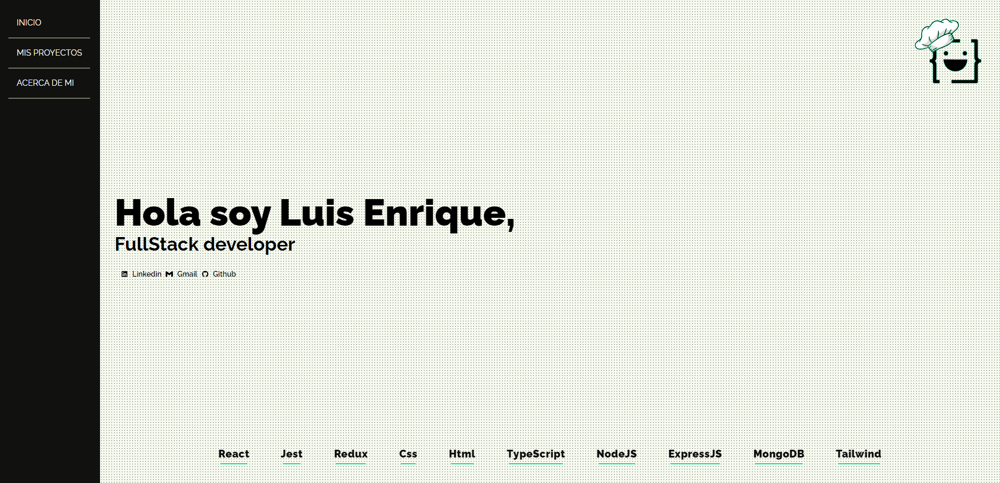
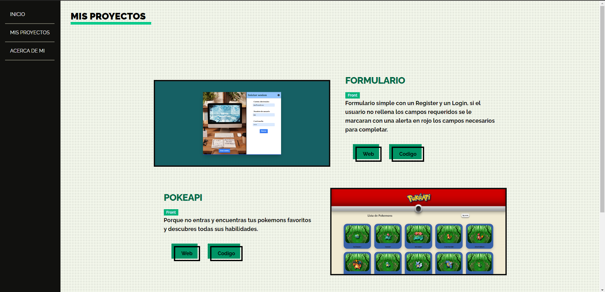
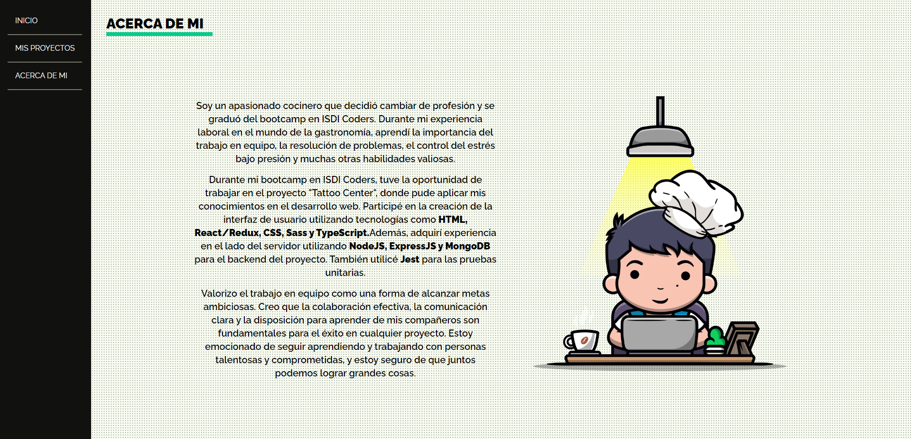

<h1 align='center'>Portfolio</h1>

        

        

## Descripcion

Mi pagina personal donde muestro todos mis proyectos tanto front como back,un portfolio simple pero bonito con colores minimalistas. He utilizado tailwind Css para este proyecto y es totalmente responsive.

## 🖥️ Despliegue

Puedes mirar entrando aqui ->[Web portfolio](https://luis-enrique-developer.netlify.app/)

## 🚀 Instalación

1. Clona este proyecto.
2. Ve a la carpeta del proyecto
   `portfolio`
3. Instala las dependencias
   `npm install` || `npm i`
4. Corre en local
   `npm start`
